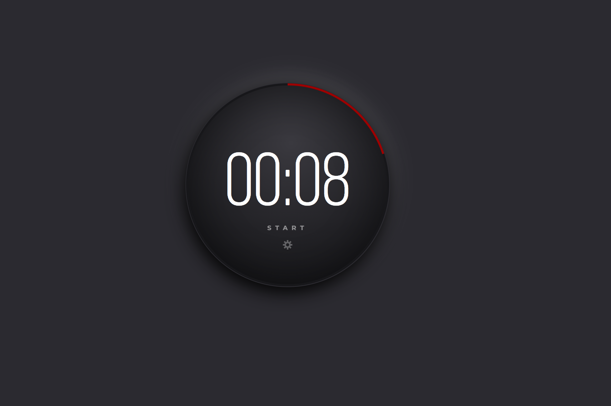

# Advent Calendar Day 1 - Pomodoro Timer

This project is part of an advent calendar proposed by https://store.selfteach.me.
The HTML and CSS files are provided and I was in charge of coding the javascript file.

I added the following options:

- Start and Stop the timer
- Possibility to enter the number of minutes/seconds
- Progress bar to show the time remaining/spent

## Screenshots

